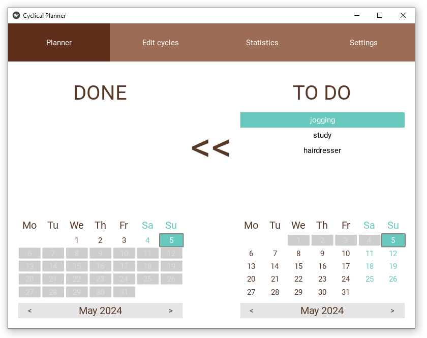

# Cyclical-Planner
Planner for repetetive tasks.

>>>>> IN ACTIVE DEVELOPMENT PHASE

**Disclaimer**: I created this planner for myself because I couldn't find an existing app with this behaviour. The code does not follow any kind of strict coding standard. It's written to be maintained by a single person - me ;)

**The idea**: Say you want to go jogging every 3 days, the planner will show this task every third day. If you don't go jogging as expected, the planner will start to suggest jogging every day untill you do that. Then the cycle will get adjusted to show "jogging" task again 3 days from that moment. Also you don't have to check in the done task right away. If it's the next day already, you just take the "jogging" task from today's TO DO tasks and put it into yesterday's DONE tasks (or any other date), and the planner will recalculate everything accordingly.



## Open planner automatically on startup:
<details>
<summary>Linux</summary>
create a bash script, e.g. run.bash:

```
cd /PATH/TO/Cycle-Planner/
python3 main.py
```

Create a .desktop file in ~/.config/autostart

```
[Desktop Entry]
X-SnapInstanceName=cyclical
Name=Cyclical Planner
StartupWMClass=CyclicalPlanner
Comment=Cyclical Planner Desktop
GenericName=Cyclical Planner Client for Linux
Exec=bash /PATH/TO/Cyclical-Planner/run.sh
Type=Application
Categories=Utility;
```

</details>

<details>
<summary>Windows</summary>

open Task Scheduler --> Create Task --> 
General
- give it a name
- check "run with highest privileges
Triggers -- New
- Begin the task: At log on
Action --> New
- Program/script: C:/Users/USER_NAME/AppData/Local/Programs/Python/Python310/pythonw.exe
- Add arguments: path/to/Cyclical-Planner/main.py

</details>